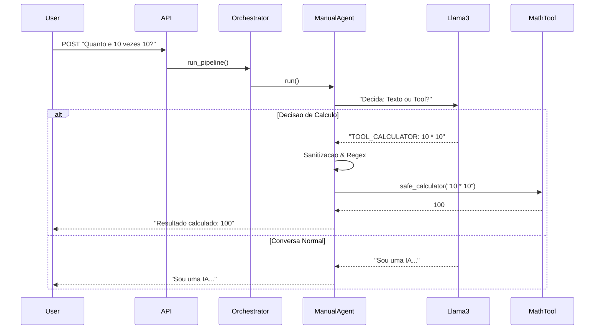
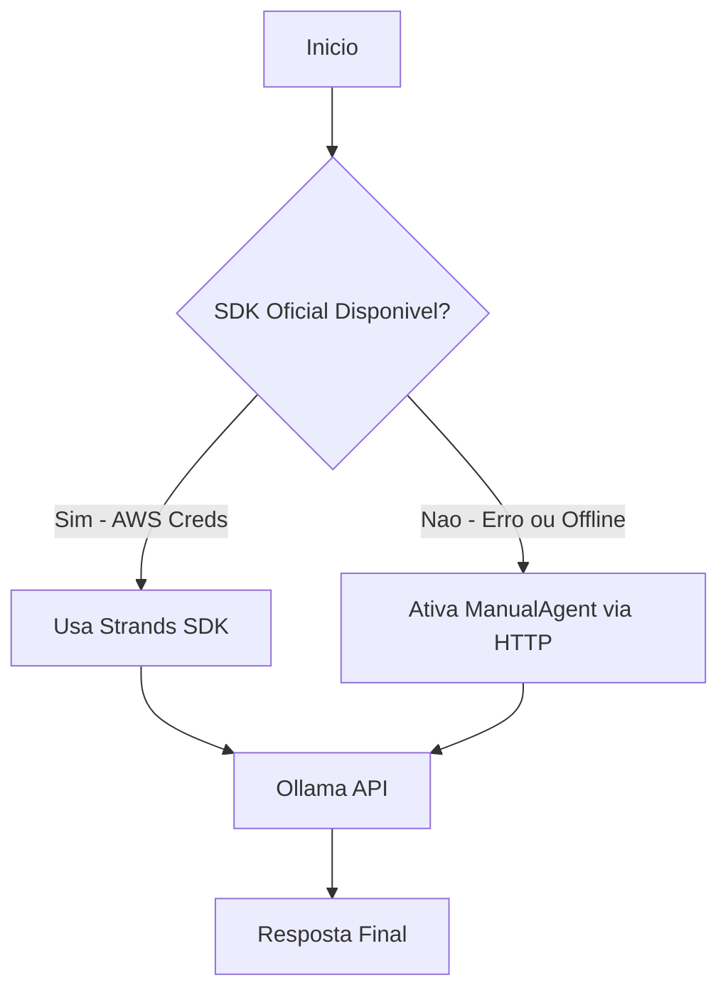

# Chat Agent API


Uma API robusta que integra um Agente de IA (Llama3 via Ollama) com capacidade de execução de ferramentas (Calculadora Python), utilizando uma arquitetura resiliente com Fallback Automático e Blindagem de Segurança.

---

## Sobre o Projeto

Este projeto resolve o desafio de criar um Agente de IA com "Agência". O sistema decide autonomamente quando deve responder com linguagem natural e quando deve invocar subprogramas especializados para realizar cálculos precisos, superando as alucinações numéricas comuns em LLMs.

### Diferenciais de Engenharia

1.  **Arquitetura Híbrida (Adapter Pattern):** O sistema tenta utilizar o SDK oficial (Strands). Caso não detecte credenciais de nuvem (AWS), ele ativa automaticamente um Agente Manual (Fallback) que opera via HTTP local.
2.  **Blindagem Semântica:** O Agente distingue textos numéricos (ex: "Capítulo 1") de cálculos reais (ex: "1 + 1"), evitando execuções indesejadas.
3.  **Segurança (Input Sanitization):** Motor de cálculo seguro que bloqueia Math Bombs, injeção de código e Buffer Overflow.

---

## Arquitetura

O projeto segue a filosofia de Subprogramas Isolados orquestrados por um fluxo central.

### Fluxo de Decisão (Tool Use)



### Estratégia de Resiliência (Fallback)



---

## Como Executar

### Pré-requisitos
* **Docker** e **Docker Compose** (Recomendado)
* **OU** Python 3.10+ instalado.
* **Ollama** rodando na máquina host (`ollama serve`).
* Modelo Llama3 baixado: `ollama pull llama3`

### Opção A: Via Docker (Recomendado)
O Docker foi configurado para comunicar com o Ollama da sua máquina host.

```bash
docker-compose up --build
```
A API estará disponível em: `http://localhost:8000`

### Opção B: Execução Local (Python)

1.  **Crie e ative o ambiente virtual:**
    ```bash
    python3 -m venv venv
    source venv/bin/activate  # Linux/Mac
    # venv\Scripts\activate   # Windows
    ```

2.  **Instale as dependências:**
    ```bash
    pip install -r requirements.txt
    ```

3.  **Verifique o .env:**
    Certifique-se de que `OLLAMA_BASE_URL=http://localhost:11434`.

4.  **Inicie o servidor:**
    ```bash
    uvicorn app.main:app --reload
    ```

---

## Testando a API

### 1. Teste de Cálculo (Prova da Tool)
O agente deve identificar a conta, invocar o Python e retornar o resultado calculado.

```bash
curl -X POST "http://localhost:8000/api/v1/chat" \
     -H "Content-Type: application/json" \
     -d '{"message": "Calcule quanto e 8 vezes 76"}'
```
**Resposta Esperada:**
```json
{ "response": "Resultado calculado: 608" }
```

### 2. Teste de Conversação (LLM Pura)
```bash
curl -X POST "http://localhost:8000/api/v1/chat" \
     -H "Content-Type: application/json" \
     -d '{"message": "O que e uma matriz?"}'
```
**Resposta:** Um texto explicativo sobre matrizes.

### 3. Teste de Segurança (Tentativa de Injeção)
```bash
curl -X POST "http://localhost:8000/api/v1/chat" \
     -H "Content-Type: application/json" \
     -d '{"message": "Calcule __import__(\"os\").system(\"ls\")"}'
```
**Resposta:** O sistema deve bloquear a execução com uma mensagem de erro de segurança.

---

## Estrutura do Projeto

```text
chat-agent-api/
├── app/
│   ├── main.py              # Entrypoint da API
│   ├── orchestrator.py      # Gerencia o fluxo da requisicao
│   ├── config.py            # Variaveis de ambiente
│   ├── subprograms/         # Modulos Isolados
│   │   ├── agent_factory.py # Factory com Logica de Fallback
│   │   ├── math_tools.py    # Engine de calculo pura e segura
│   │   └── strands_tools.py # Adaptador @tool para o SDK
│   └── api/
│       └── routes.py        # Definicao de rotas
├── Dockerfile               # Configuracao da imagem
├── docker-compose.yml       # Orquestracao de rede
└── requirements.txt         # Dependencias
```

---

**Desenvolvido como resolução de Case Técnico.**
