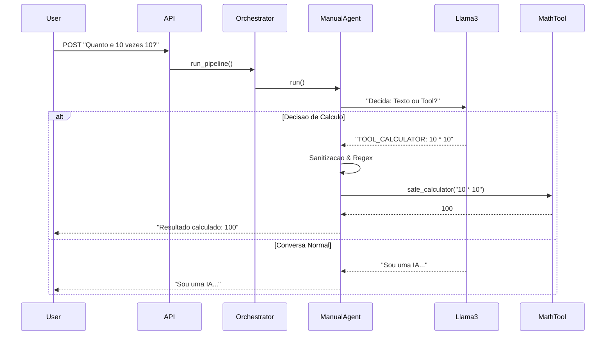

# Chat Agent API


Uma API robusta que integra um Agente de IA (Llama3 via Ollama) com capacidade de execução de ferramentas (Calculadora Python), utilizando uma arquitetura resiliente com Fallback Automático e Blindagem de Segurança.

---

## Sobre o Projeto

Este projeto foi desenvolvido para resolver o desafio de criar um Agente de IA com "Agência" (capacidade de agir). O sistema decide autonomamente quando deve responder com linguagem natural e quando deve invocar subprogramas especializados para realizar cálculos precisos, superando as alucinações numéricas comuns em LLMs.

### Diferenciais de Engenharia

1.  **Arquitetura Híbrida (Adapter Pattern):** O sistema tenta utilizar o SDK oficial (Strands). Caso não detecte credenciais de nuvem (AWS), ele ativa automaticamente um Agente Manual (Fallback) que opera via HTTP local, garantindo que o projeto funcione em qualquer ambiente offline.
2.  **Blindagem Semântica:** O Agente foi treinado via Prompt Engineering e Regex Parsers para distinguir textos numéricos (ex: "Capítulo 1") de cálculos reais (ex: "1 + 1"), evitando execuções indesejadas.
3.  **Segurança (Input Sanitization):** Implementação de um motor de cálculo seguro (safe_calculator) que bloqueia Math Bombs (exponenciação infinita), injeção de código e Buffer Overflow.

---

## Arquitetura e Funcionamento

O projeto segue a filosofia de **Subprogramas Isolados** orquestrados por um fluxo central. A aplicação não expõe a IA diretamente ao usuário; em vez disso, um "Orquestrador" analisa a requisição e delega tarefas.

1.  **Recepção:** A API recebe a mensagem e valida o formato via Pydantic.
2.  **Análise de Intenção:** O Agente (Llama3) avalia se a pergunta requer raciocínio criativo ou exatidão matemática.
3.  **Decisão de Ferramenta:** Se um cálculo for necessário, o Agente emite um comando (`TOOL_CALCULATOR`) em vez de tentar responder.
4.  **Execução Segura:** O sistema intercepta o comando, sanitiza a entrada, executa o cálculo em Python puro e devolve o resultado preciso.

### Fluxo de Decisão (Tool Use)



### Estratégia de Resiliência (Fallback)

```mermaid
flowchart TD
    A[Inicio] --> B{SDK Oficial Disponivel?}
    B -- Sim (AWS Creds) --> C[Usa Strands SDK]
    B -- Nao (Erro/Offline) --> D[Ativa ManualAgent (HTTP)]
    C --> E[Ollama API]
    D --> E
    E --> F[Resposta Final]
```

---

## Como Executar

### Pré-requisitos
* **Python 3.10+** instalado.
* **Ollama** rodando na máquina host (`ollama serve`).
* Modelo Llama3 baixado: `ollama pull llama3`

### Opção A: Execução Local (Python) - Recomendado

Este método é o mais direto para desenvolvimento e depuração, conectando-se nativamente ao serviço do Ollama local.

1.  **Crie e ative o ambiente virtual:**
    ```bash
    python3 -m venv venv
    source venv/bin/activate  # Linux/Mac
    # venv\Scripts\activate   # Windows
    ```

2.  **Instale as dependências:**
    ```bash
    pip install -r requirements.txt
    ```

3.  **Verifique a configuração:**
    O projeto já vem configurado para buscar o Ollama em `http://localhost:11434`.

4.  **Inicie o servidor:**
    ```bash
    uvicorn app.main:app --reload
    ```
    A API estará disponível em: `http://localhost:8000`

### Opção B: Via Docker

O Docker foi configurado para comunicar com o Ollama da sua máquina host através do gateway interno.

```bash
docker-compose up --build
```

---

## Testando a API

Você pode testar utilizando `curl` no terminal.

### 1. Teste de Cálculo (Prova da Tool)
O agente deve identificar a conta, invocar o Python e retornar o resultado calculado.

```bash
curl -X POST "http://localhost:8000/api/v1/chat" \
     -H "Content-Type: application/json" \
     -d '{"message": "Calcule quanto e 8 vezes 76"}'
```
**Resposta Esperada:**
```json
{ "response": "Resultado calculado: 608" }
```

### 2. Teste de Conversação (LLM Pura)
```bash
curl -X POST "http://localhost:8000/api/v1/chat" \
     -H "Content-Type: application/json" \
     -d '{"message": "O que e uma matriz?"}'
```
**Resposta:** Um texto explicativo sobre matrizes (sem tentar calcular o número "1" de uma lista).

### 3. Teste de Segurança (Tentativa de Injeção)
```bash
curl -X POST "http://localhost:8000/api/v1/chat" \
     -H "Content-Type: application/json" \
     -d '{"message": "Calcule __import__(\"os\").system(\"ls\")"}'
```
**Resposta:** O sistema deve bloquear a execução com uma mensagem de erro de segurança.

---

## Testes Automatizados (QA)

O projeto inclui uma suíte de testes automatizados desenvolvida com **pytest** para garantir a estabilidade do código e a segurança das ferramentas.

### Cobertura dos Testes
1.  **Testes Unitários (Math Engine):** Validam isoladamente se a calculadora resolve expressões corretamente (`10 * 10`, `sqrt(144)`) sem depender da IA.
2.  **Testes de Segurança:** Simulam ataques de injeção de código e *Math Bombs* (exponenciação infinita) para garantir que o sanitizador bloqueie a execução antes de afetar o sistema.
3.  **Testes de Integração (API):** Verificam se o endpoint `/chat` está acessível, se valida os schemas JSON corretamente e se trata erros de payload vazio.

### Como Rodar
No terminal, com o ambiente virtual ativo:

```bash
pytest -v
```

---

## Estrutura do Projeto

```text
chat-agent-api/
├── app/
│   ├── main.py              # Entrypoint da API
│   ├── orchestrator.py      # Gerencia o fluxo da requisicao
│   ├── config.py            # Variaveis de ambiente
│   ├── subprograms/         # Modulos Isolados (Filosofia de Subprogramas)
│   │   ├── agent_factory.py # Factory com Logica de Fallback (SDK/Manual)
│   │   ├── math_tools.py    # Engine de calculo pura e segura (Math Bomb protection)
│   │   └── strands_tools.py # Adaptador @tool para o SDK
│   └── api/
│       └── routes.py        # Definicao de rotas
├── tests/                   # Suite de testes automatizados (pytest)
├── Dockerfile               # Configuracao da imagem
├── docker-compose.yml       # Orquestracao de rede
└── requirements.txt         # Dependencias
```

---

**Desenvolvido como resolução de Case Técnico.**